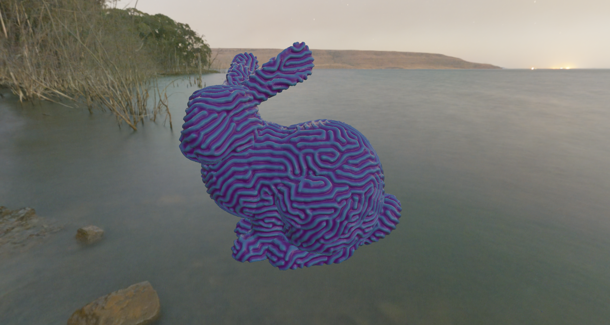
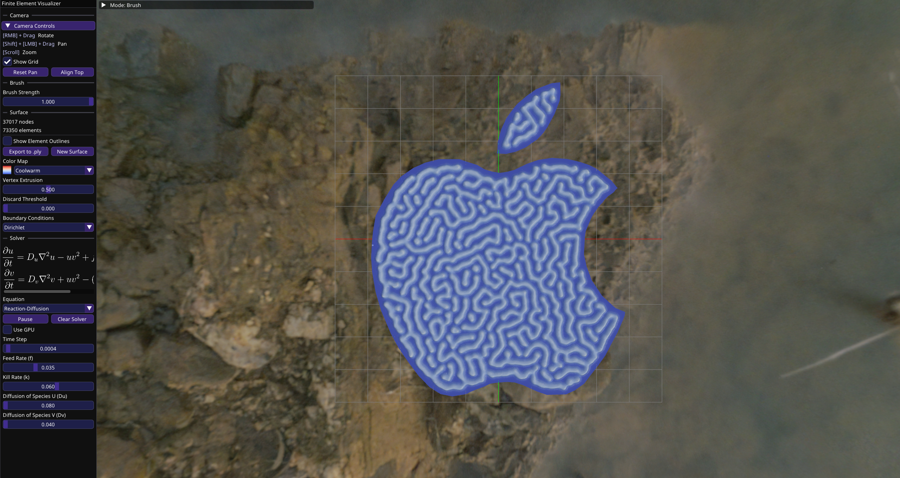

# Finite Element Visualizer 

This project solves time-dependent partial differential equations (PDEs) on complex geometries by using the [Finite Element Method](https://en.wikipedia.org/wiki/Finite_element_method). In particular, this project currently provides solvers for the following equations: [Heat Equation](https://en.wikipedia.org/wiki/Heat_equation), [Wave Equation](https://en.wikipedia.org/wiki/Wave_equation), [Advection-Diffusion Equation](https://en.wikipedia.org/wiki/Convection%E2%80%93diffusion_equation), and [Gray-Scott Reaction-Diffusion Equation](https://groups.csail.mit.edu/mac/projects/amorphous/GrayScott/)

### Features
- Creating simulation domains either by loading a 3D mesh from a file or drawing a planar straight line graph (PSLG) to triangulate into a planar mesh.
- CPU solver using [Eigen](https://libeigen.gitlab.io/) and a GPU solver using my implementation of the conjugate gradient method with compute shaders
- Exporting the final mesh to a .ply file with extruded vertex positions and color mapped vertex colors
- Drawing initial conditions directly on a surface using the mouse

## Screenshots & Videos
#### Reaction-Diffusion on the Stanford Bunny:

#### Reaction-Diffusion on the Apple logo, triangulated from a PSLG:

#### Wave Equation on a sphere:


## Installation
Builds for Windows and Linux are available in the [Releases](https://github.com/tvumcc/fea-visualizer/releases) tab.

## Building from Source
This project uses CMake for compilation, so make sure CMake is installed before proceeding.

```bash
git clone https://github.com/tvumcc/fea-visualizer.git --recursive
cd fea-visualizer
cmake -S . -B build -G "Unix Makefiles" -DCMAKE_BUILD_TYPE=Release
cmake --build build
```

Be sure to use the appropriate generator for the OS you are compiling on. Run `cmake -G` to see a list of generators. If you are using a multi-configuration generator like MSVC or Xcode, use the argument `--config Release` when calling the build command to compile in Release mode.

When running the executable, make sure it is run from the same directory that contains the `shaders` and `assets` directories otherwise shaders, images, meshes, and other assets will be unable to load.

## Attribution

### Libraries Used
- [glfw](https://github.com/glfw/glfw) - windowing and input handling
- [glad](https://gen.glad.sh/) - OpenGL function and enum loading
- [glm](https://github.com/g-truc/glm) - linear algebra library for use with OpenGL
- [eigen](https://gitlab.com/libeigen/eigen) - linear algebra library for solving linear systems
- [imgui](https://github.com/ocornut/imgui) - drawing the GUI
- [stb_image.h](https://github.com/nothings/stb/blob/master/stb_image.h) - image file loading
- [tinyobjloader](https://github.com/tinyobjloader/tinyobjloader) - .obj file loading
- [nativefiledialog](https://github.com/mlabbe/nativefiledialog) - cross platform interface to a file dialog
- [triangle](https://github.com/libigl/triangle) - Delaunay triangulation for PSLGs

### References
- Professor Qiqi Wang's Lectures on the Finite Element Method on his channel [AerodynamicCFD](https://www.youtube.com/@AeroCFD): [2020 Lecture 12](https://www.youtube.com/playlist?list=PLcqHTXprNMIOEwNpmNo7HWx68FzBTxTh3), [13](https://www.youtube.com/playlist?list=PLcqHTXprNMIPvSgBidAYOY1fIunDywInP), [14](https://www.youtube.com/playlist?list=PLcqHTXprNMIN-YciJQ4gtVGrlrhG8bPQp), [15](https://www.youtube.com/playlist?list=PLcqHTXprNMIMvURxGSkTe6ef3-DhfJxEn), and [2016 Lecture 16](https://www.youtube.com/playlist?list=PLcqHTXprNMIOhhcvwc5bWNs5CQfNKhpM-)
- [mbn010/Gray-Scott-reaction-diffusion-on-a-sphere](https://github.com/mbn010/Gray-Scott-reaction-diffusion-on-a-sphere)
- [An Introduction to the Conjugate Gradient Method Without the Agonizing Pain](https://www.cs.cmu.edu/~quake-papers/painless-conjugate-gradient.pdf) by Jonathan Richard Shewchuk 

Time spent on this project: <br>
